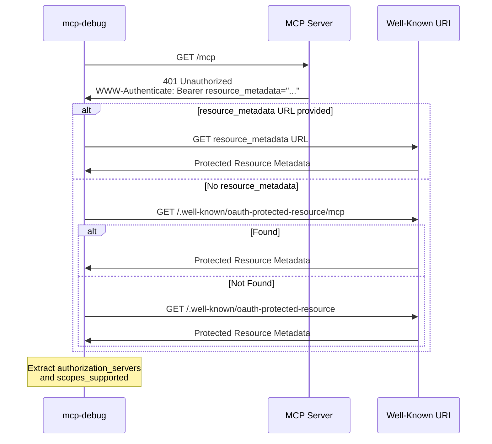
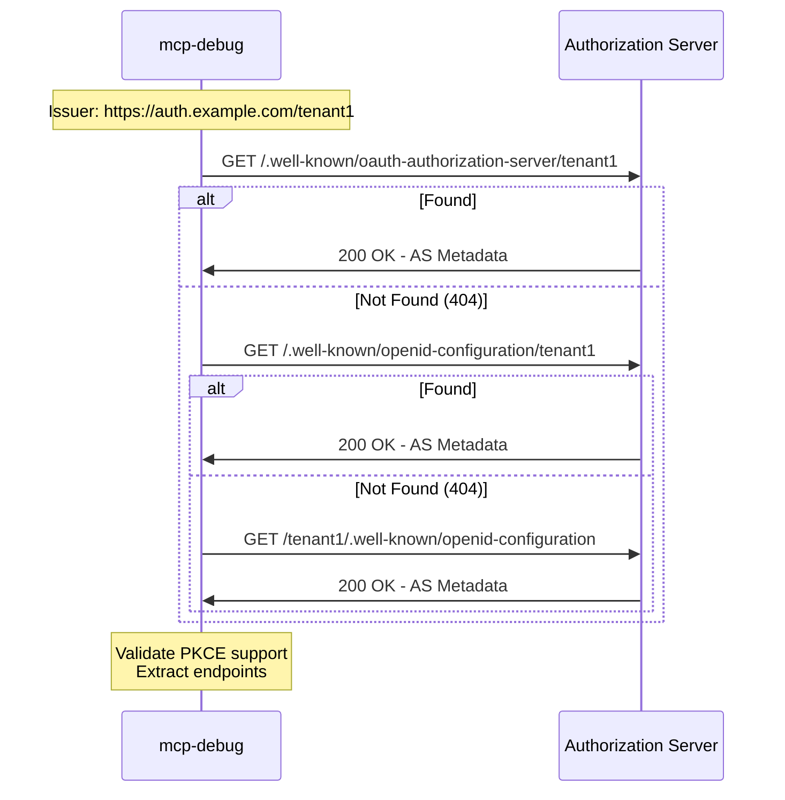
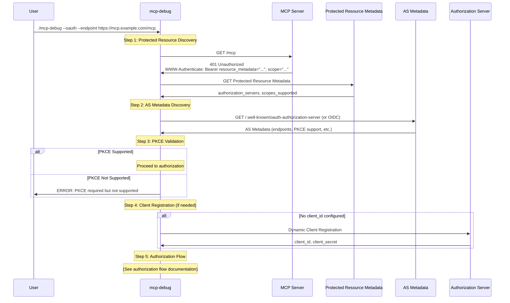

# OAuth Discovery

`mcp-debug` implements automatic discovery of authorization servers and required scopes through industry-standard protocols. This eliminates manual configuration and enables secure, zero-config OAuth flows.

## Table of Contents

- [Overview](#overview)
- [Protected Resource Metadata Discovery (RFC 9728)](#protected-resource-metadata-discovery-rfc-9728)
- [Authorization Server Metadata Discovery (RFC 8414)](#authorization-server-metadata-discovery-rfc-8414)
- [Discovery Flow](#discovery-flow)
- [Configuration Options](#configuration-options)
- [Examples](#examples)
- [Troubleshooting](#troubleshooting)

## Overview

Discovery happens automatically when you connect to an OAuth-protected MCP server:

```bash
./mcp-debug --oauth --endpoint https://mcp.example.com/mcp
```

The discovery process:

1. **Protected Resource Discovery** (RFC 9728): Find authorization server(s) and required scopes
2. **AS Metadata Discovery** (RFC 8414): Discover OAuth endpoints and capabilities
3. **PKCE Validation**: Verify authorization server supports required security features

All discovery happens securely over HTTPS with proper validation.

## Protected Resource Metadata Discovery (RFC 9728)

[RFC 9728](https://datatracker.ietf.org/doc/html/rfc9728) enables the MCP server to advertise its authorization server(s) and required scopes.

### How It Works

When OAuth is enabled, `mcp-debug`:

1. Makes an initial request to the MCP server
2. Expects a `401 Unauthorized` response with a `WWW-Authenticate` header
3. Parses the header for discovery hints
4. Fetches the protected resource metadata document
5. Extracts authorization server URLs and supported scopes

### WWW-Authenticate Header

The MCP server's initial 401 response includes discovery information:

```
WWW-Authenticate: Bearer resource_metadata="https://mcp.example.com/.well-known/oauth-protected-resource",
                         scope="mcp:read mcp:write"
```

**Parameters:**

- `resource_metadata`: URL to fetch the full metadata document
- `scope`: Required scopes for this resource (used in [scope selection](scopes.md))

### Well-Known URI Discovery

If no `resource_metadata` parameter is provided, `mcp-debug` tries well-known URIs in priority order:

```
1. https://mcp.example.com/.well-known/oauth-protected-resource/mcp  (path-specific)
2. https://mcp.example.com/.well-known/oauth-protected-resource      (root)
```

### Protected Resource Metadata Document

Example metadata response:

```json
{
  "resource": "https://mcp.example.com/mcp",
  "authorization_servers": [
    "https://auth.example.com",
    "https://auth-backup.example.com"
  ],
  "scopes_supported": ["mcp:read", "mcp:write", "mcp:admin"],
  "bearer_methods_supported": ["header"],
  "resource_documentation": "https://mcp.example.com/docs/auth"
}
```

**Key Fields:**

- `resource`: Canonical URI of the protected resource
- `authorization_servers`: List of authorization servers (priority order)
- `scopes_supported`: OAuth scopes available for this resource
- `bearer_methods_supported`: How to present access tokens (typically "header")
- `resource_documentation`: Optional documentation URL

### Multiple Authorization Servers

When multiple authorization servers are available, `mcp-debug` uses the first one by default. You can override this:

```bash
./mcp-debug --oauth \
  --oauth-preferred-auth-server https://auth-backup.example.com \
  --endpoint https://mcp.example.com/mcp
```

### Discovery Flow Diagram



### Disabling Protected Resource Discovery

For testing with older servers:

```bash
./mcp-debug --oauth \
  --oauth-skip-resource-metadata \
  --endpoint https://legacy-server.com/mcp
```

**Warning**: This disables automatic authorization server discovery. You'll need to provide authorization endpoints manually or rely on fallback mechanisms.

## Authorization Server Metadata Discovery (RFC 8414)

Once the authorization server URL is discovered, `mcp-debug` fetches its metadata to learn about supported endpoints and features.

### How It Works

`mcp-debug` implements multi-endpoint probing per [RFC 8414](https://www.rfc-editor.org/rfc/rfc8414.html) and [OpenID Connect Discovery](https://openid.net/specs/openid-connect-discovery-1_0.html):

For issuer **with** path component (`https://auth.example.com/tenant1`):

```
1. https://auth.example.com/.well-known/oauth-authorization-server/tenant1 (OAuth 2.0 path insertion)
2. https://auth.example.com/.well-known/openid-configuration/tenant1        (OIDC path insertion)
3. https://auth.example.com/tenant1/.well-known/openid-configuration        (OIDC path appending)
```

For issuer **without** path component (`https://auth.example.com`):

```
1. https://auth.example.com/.well-known/oauth-authorization-server (OAuth 2.0)
2. https://auth.example.com/.well-known/openid-configuration        (OIDC)
```

The first successfully retrieved metadata document is used.

### Why Multiple Endpoints?

Different authorization server implementations follow different conventions:

- **OAuth 2.0 servers**: Use `/.well-known/oauth-authorization-server`
- **OIDC providers**: Use `/.well-known/openid-configuration`
- **Multi-tenant servers**: May use path insertion or appending

`mcp-debug` tries all standard locations for maximum compatibility.

### Authorization Server Metadata Document

Example AS metadata:

```json
{
  "issuer": "https://auth.example.com",
  "authorization_endpoint": "https://auth.example.com/oauth/authorize",
  "token_endpoint": "https://auth.example.com/oauth/token",
  "registration_endpoint": "https://auth.example.com/oauth/register",
  "scopes_supported": ["openid", "profile", "mcp:read", "mcp:write"],
  "response_types_supported": ["code"],
  "grant_types_supported": ["authorization_code", "refresh_token"],
  "code_challenge_methods_supported": ["S256"],
  "token_endpoint_auth_methods_supported": ["none", "client_secret_post"],
  "client_id_metadata_document_supported": true
}
```

**Critical Fields:**

- `authorization_endpoint`: Where to send users for authorization (required)
- `token_endpoint`: Where to exchange codes for tokens (required)
- `registration_endpoint`: Dynamic Client Registration endpoint (optional)
- `code_challenge_methods_supported`: PKCE support - **MUST** include "S256" per MCP spec
- `client_id_metadata_document_supported`: Indicates support for Client ID Metadata Documents

### PKCE Support Validation

The MCP specification **requires** authorization servers to support PKCE with the S256 method. `mcp-debug` enforces this by:

1. Checking for `code_challenge_methods_supported` in AS metadata
2. Verifying `"S256"` is in the list
3. **Refusing to connect** if PKCE support is not advertised

```bash
# This will fail if server doesn't advertise PKCE support
./mcp-debug --oauth --endpoint https://mcp.example.com/mcp
```

Output if PKCE is missing:

```
ERROR: Authorization server does not advertise PKCE support with S256 method
ERROR: code_challenge_methods_supported: []
ERROR: Per MCP spec, PKCE is required for security
```

**Important:** PKCE validation cannot be bypassed. Per MCP specification (2025-11-25), PKCE with S256 method is **mandatory**. Servers that don't support PKCE are not MCP-compliant.

### AS Metadata Discovery Flow Diagram



**Note**: Authorization server metadata discovery is automatic. If needed, you can manually specify the authorization server using `--oauth-preferred-auth-server`.

## Discovery Flow

The complete discovery flow when connecting with OAuth:



## Configuration Options

### Discovery Flags

| Flag | Description | Default | Security Impact |
|------|-------------|---------|-----------------|
| `--oauth-skip-resource-metadata` | Disable RFC 9728 discovery | `false` | Medium - manual AS config needed |
| `--oauth-preferred-auth-server` | Select specific AS | (none) | None - overrides priority |

### When to Use Discovery Flags

**Skip Resource Metadata** (`--oauth-skip-resource-metadata`):
- Testing older MCP servers (pre-2025 spec)
- Using pre-configured authorization endpoints
- Debugging discovery issues
- Server doesn't implement RFC 9728

**Preferred Authorization Server** (`--oauth-preferred-auth-server`):
- Multiple authorization servers available
- Want to use specific AS
- Override automatic selection

## Examples

### Automatic Discovery (Recommended)

```bash
./mcp-debug --oauth --endpoint https://mcp.example.com/mcp
```

`mcp-debug` discovers everything automatically.

### Manual Authorization Server

Specify the authorization server directly:

```bash
./mcp-debug --oauth \
  --oauth-skip-resource-metadata \
  --oauth-preferred-auth-server https://auth.example.com \
  --endpoint https://mcp.example.com/mcp
```

### Debug Discovery Process

Enable verbose logging to see discovery details:

```bash
./mcp-debug --oauth --verbose \
  --endpoint https://mcp.example.com/mcp
```

You'll see logs like:

```
[INFO] Protected Resource Metadata discovery enabled
[INFO] Fetching Protected Resource Metadata from https://mcp.example.com/.well-known/oauth-protected-resource
[INFO] Discovered authorization servers: [https://auth.example.com]
[INFO] Discovered scopes: [mcp:read mcp:write]
[INFO] Attempting AS Metadata discovery for issuer: https://auth.example.com
[INFO] Trying: https://auth.example.com/.well-known/oauth-authorization-server
[INFO] ✓ AS Metadata retrieved successfully
[INFO] Authorization endpoint: https://auth.example.com/oauth/authorize
[INFO] Token endpoint: https://auth.example.com/oauth/token
[INFO] PKCE methods supported: [S256]
[INFO] ✓ PKCE validation passed
```

### Multiple Authorization Servers

When the MCP server provides multiple authorization servers:

```json
{
  "authorization_servers": [
    "https://auth.example.com",
    "https://auth-eu.example.com",
    "https://auth-backup.example.com"
  ]
}
```

Use the EU server:

```bash
./mcp-debug --oauth \
  --oauth-preferred-auth-server https://auth-eu.example.com \
  --endpoint https://mcp.example.com/mcp
```

## Troubleshooting

### Discovery Fails with 404

**Problem**: Protected Resource Metadata not found

**Solution**: The server may not support RFC 9728. Try skipping discovery:

```bash
./mcp-debug --oauth --oauth-skip-resource-metadata \
  --endpoint https://mcp.example.com/mcp
```

### PKCE Validation Fails

**Problem**: Server doesn't advertise PKCE support

**Error:**

```
ERROR: Authorization server does not advertise PKCE support with S256 method
ERROR: Per MCP spec, PKCE is required for security
```

**Diagnosis**: Check if server actually supports PKCE by reviewing its documentation

**Important**: PKCE is **mandatory** per MCP specification. There is no bypass flag. If the authorization server doesn't support PKCE with S256 method, you cannot connect to MCP servers through it.

**Actions**:
- Report to server operator that PKCE is required
- Server must implement RFC 7636 with S256 method
- Update the server's AS metadata to advertise `code_challenge_methods_supported: ["S256"]`

### Multiple AS Metadata Endpoints Fail

**Problem**: All well-known URIs return 404

**Diagnosis**: Check the authorization server issuer URL format

**Solution**: Verify the issuer URL and specify the preferred auth server manually:

```bash
./mcp-debug --oauth \
  --oauth-preferred-auth-server https://auth.example.com \
  --endpoint https://mcp.example.com/mcp
```

### Wrong Authorization Server Selected

**Problem**: Multiple servers available, wrong one chosen

**Solution**: Specify preferred server:

```bash
./mcp-debug --oauth \
  --oauth-preferred-auth-server https://auth-correct.example.com \
  --endpoint https://mcp.example.com/mcp
```

## See Also

- [Scope Management](scopes.md): How discovered scopes are used
- [Client Registration](client-registration.md): What happens after discovery
- [Security](security.md): Why PKCE validation matters
- [Testing](testing.md): Using compatibility flags safely
- [RFC 9728](https://datatracker.ietf.org/doc/html/rfc9728): Protected Resource Metadata specification
- [RFC 8414](https://www.rfc-editor.org/rfc/rfc8414.html): Authorization Server Metadata specification
- [MCP Authorization Spec](https://spec.modelcontextprotocol.io/specification/2025-11-25/basic/authorization/): MCP OAuth requirements

