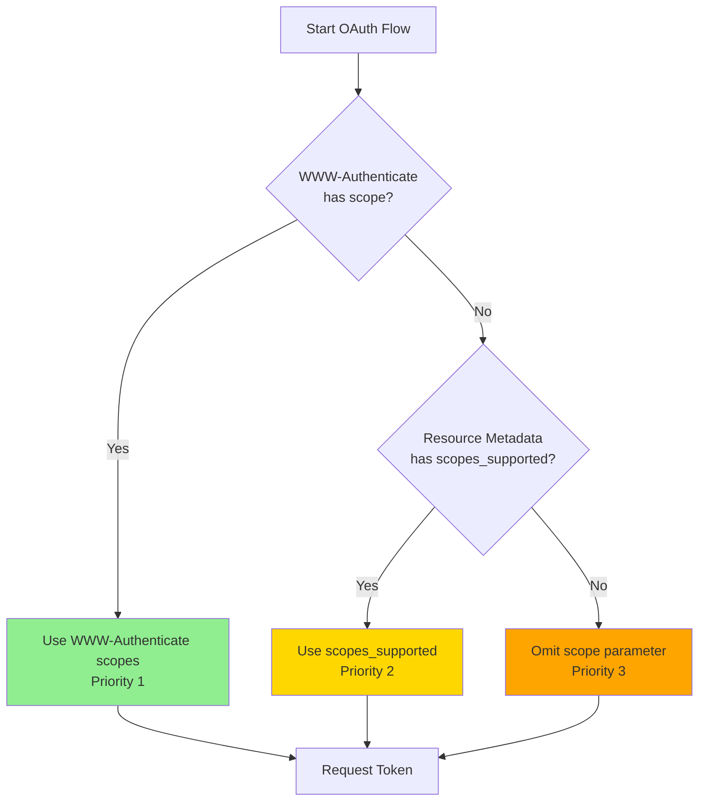
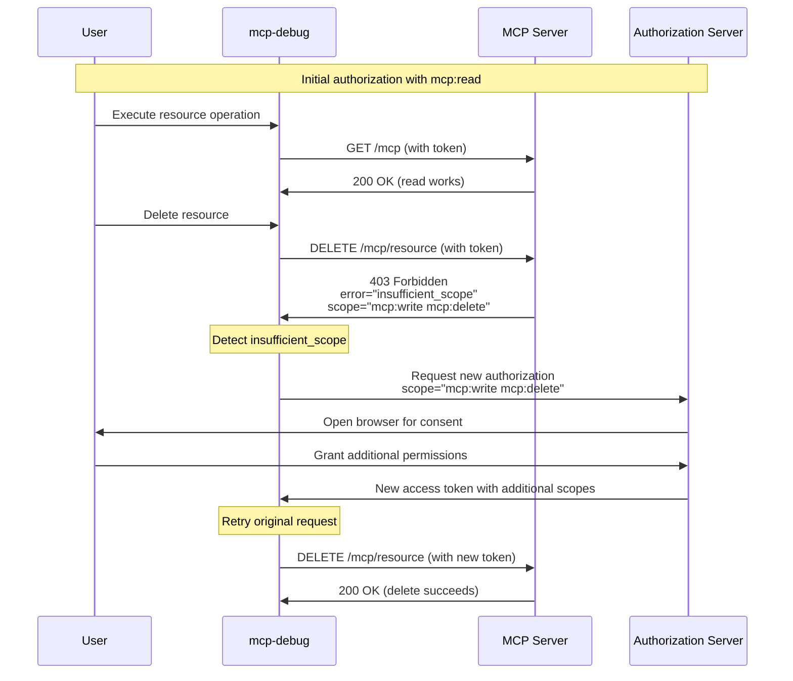

# OAuth Scopes and Step-Up Authorization

`mcp-debug` implements intelligent scope management following the MCP specification's principle of least privilege, with automatic step-up authorization when additional permissions are needed.

## Table of Contents

- [Overview](#overview)
- [Scope Selection Modes](#scope-selection-modes)
- [Auto Mode (Recommended)](#auto-mode-recommended)
- [Manual Mode](#manual-mode)
- [Step-Up Authorization](#step-up-authorization)
- [Configuration](#configuration)
- [Examples](#examples)
- [Security Considerations](#security-considerations)
- [Troubleshooting](#troubleshooting)

## Overview

OAuth scopes define the permissions an access token grants. `mcp-debug` provides two modes for scope selection:

- **Auto Mode** (default): Follows MCP spec priority for secure, automatic scope selection
- **Manual Mode**: Explicitly specify scopes, overriding automatic discovery

Both modes support step-up authorization, which handles runtime permission escalation when operations require additional scopes.

## Scope Selection Modes

### Comparison

| Feature | Auto Mode | Manual Mode |
|---------|-----------|-------------|
| Security | Secure by default (least privilege) | Requires careful configuration |
| UX | Automatic, no configuration | Explicit control |
| Compliance | Follows MCP spec | User-controlled |
| Risk | Low (requests minimal scopes) | Medium (may over-request) |
| Use Case | Production, general use | Testing, debugging, custom flows |

## Auto Mode (Recommended)

Auto mode implements the MCP specification's scope selection priority to ensure least-privilege access.

### Priority Order

1. **WWW-Authenticate Scope** (highest priority)
   - Server returns 401 with `WWW-Authenticate: Bearer scope="..."`
   - These are the scopes **required** for this specific resource
   - Most specific, highest priority

2. **Protected Resource Metadata Scopes**
   - Discovered via RFC 9728 `scopes_supported`
   - Scopes supported by the MCP server
   - Less specific than WWW-Authenticate

3. **Omit Scope Parameter** (lowest priority)
   - If no scopes discovered, don't include scope parameter
   - Minimal permissions per OAuth 2.1 best practices
   - Server grants default scopes

### Usage

Auto mode is the default:

```bash
./mcp-debug --oauth --endpoint https://mcp.example.com/mcp
```

Explicitly enable auto mode:

```bash
./mcp-debug --oauth \
  --oauth-scope-mode auto \
  --endpoint https://mcp.example.com/mcp
```

### How It Works



### Example: Auto Mode Flow

```bash
$ ./mcp-debug --oauth --endpoint https://mcp.example.com/mcp
[INFO] Scope selection mode: auto (MCP spec priority)
[INFO] Attempting to connect to MCP server...
[INFO] Received 401 Unauthorized with WWW-Authenticate header
[INFO] Discovered required scopes: [mcp:read mcp:write]
[INFO] Selected scopes (Priority 1 - WWW-Authenticate): [mcp:read mcp:write]
[INFO] Opening browser for authorization...
```

### Benefits

- **Security**: Requests only required scopes
- **Privacy**: Minimizes user consent prompts
- **Compliance**: Follows MCP specification
- **Adaptability**: Automatically adjusts to server requirements
- **Future-Proof**: Works with new scopes without code changes

## Manual Mode

Manual mode allows explicit scope specification, overriding automatic discovery.

### Usage

```bash
./mcp-debug --oauth \
  --oauth-scope-mode manual \
  --oauth-scopes "mcp:admin,mcp:debug,user:profile" \
  --endpoint https://mcp.example.com/mcp
```

### When to Use Manual Mode

**Testing Scenarios:**

- Test specific scope combinations
- Verify authorization server scope validation
- Debug insufficient_scope errors
- Test step-up authorization behavior

**Custom Requirements:**

- Server requires non-standard scopes
- Need to request scopes not in metadata
- Working with custom MCP server implementations

**Advanced Users:**

- You know exactly what scopes are needed
- Override conservative auto mode behavior
- Request broader permissions upfront

### Scope Mismatch Warnings

When manual scopes differ from discovered scopes, `mcp-debug` warns you:

```bash
$ ./mcp-debug --oauth --oauth-scope-mode manual \
    --oauth-scopes "mcp:admin" --endpoint https://mcp.example.com/mcp

[INFO] Scope selection mode: manual
[INFO] Requested scopes (manual): [mcp:admin]
[INFO] Discovered required scopes from WWW-Authenticate: [mcp:read]
[WARNING] Manual scope mode: requested scopes [mcp:admin] differ from server-discovered scopes [mcp:read]
[WARNING] This may lead to authorization failures or over-privileged tokens
[INFO] Proceeding with manual scopes...
```

### Risks

**Authorization Failures:**

```
Manual: mcp:read
Required: mcp:read, mcp:write
Result: Token lacks required permissions → 403 Forbidden
```

**Over-Privileged Tokens:**

```
Manual: mcp:admin, mcp:debug, system:all
Required: mcp:read
Result: Token has excessive permissions → security risk
```

## Step-Up Authorization

Step-up authorization handles runtime permission escalation when an operation requires additional scopes.

### What Is Step-Up Authorization?

When you attempt an operation, the server may respond with:

```
403 Forbidden
WWW-Authenticate: Bearer error="insufficient_scope",
                         scope="mcp:write mcp:delete",
                         error_description="Additional permissions required"
```

`mcp-debug` detects this, requests additional permissions, and retries the operation automatically.

### How It Works



### Automatic vs Manual Step-Up

**Automatic (Default)**:

```bash
./mcp-debug --oauth --endpoint https://mcp.example.com/mcp
```

When insufficient_scope is detected:

1. `mcp-debug` logs the requirement
2. Opens browser for additional consent
3. Obtains new token
4. Retries operation
5. User sees seamless experience

**With User Prompt** (Not Yet Implemented):

```bash
./mcp-debug --oauth \
  --oauth-step-up-prompt \
  --endpoint https://mcp.example.com/mcp
```

**Note**: Interactive prompting is not yet implemented. If you enable `--oauth-step-up-prompt`, step-up authorization will be denied for safety. The flag is reserved for future use.

### Retry Limits

To prevent infinite authorization loops, step-up authorization has retry limits:

```bash
# Default: 2 retries per resource/operation
./mcp-debug --oauth --endpoint https://mcp.example.com/mcp

# Custom retry limit
./mcp-debug --oauth \
  --oauth-step-up-max-retries 3 \
  --endpoint https://mcp.example.com/mcp
```

If retries are exceeded:

```
ERROR: Max step-up authorization retries (2) exceeded for DELETE /mcp/resource
ERROR: Possible causes:
  - Server repeatedly requesting same scopes
  - Authorization server not granting requested scopes
  - Scope validation loop
```

### Disabling Step-Up Authorization

For testing or when not needed:

```bash
./mcp-debug --oauth \
  --oauth-disable-step-up \
  --endpoint https://mcp.example.com/mcp
```

Without step-up, insufficient_scope errors are returned directly to the user:

```
ERROR: 403 Forbidden - Insufficient scope
ERROR: Required scopes: [mcp:write mcp:delete]
ERROR: Please re-run with additional scopes or enable step-up authorization
```

### Step-Up Example

```bash
$ ./mcp-debug --repl --oauth --endpoint https://mcp.example.com/mcp
[INFO] Initial scopes: [mcp:read]
[INFO] ✓ Connected successfully

>> exec delete_resource '{"id": "123"}'
[WARNING] Insufficient scope detected for DELETE /mcp/resource
[INFO] Server message: This operation requires write and delete permissions
[INFO] Required scopes: [mcp:write mcp:delete]
[INFO] AUDIT: Step-up authorization requested for DELETE /mcp/resource
[INFO] AUDIT: Requested additional scopes: [mcp:write mcp:delete]
[INFO] Step-up authorization attempt 1/2
[INFO] Requesting additional permissions...
[INFO] Opening browser for authorization...
[INFO] Waiting for authorization...
[INFO] ✓ Additional permissions granted
[INFO] Retrying request with new token...
[INFO] ✓ Request successful after step-up authorization
Resource deleted successfully
```

## Configuration

### Scope Selection Flags

| Flag | Description | Default |
|------|-------------|---------|
| `--oauth-scope-mode` | Selection mode: `auto` or `manual` | `auto` |
| `--oauth-scopes` | Comma-separated scopes for manual mode | `""` |

### Step-Up Authorization Flags

| Flag | Description | Default |
|------|-------------|---------|
| `--oauth-disable-step-up` | Disable step-up authorization | `false` (enabled) |
| `--oauth-step-up-max-retries` | Maximum retry attempts per operation | `2` |
| `--oauth-step-up-prompt` | Ask user before requesting additional scopes | `false` (automatic) |

## Examples

### Auto Mode (No Configuration)

```bash
./mcp-debug --oauth --endpoint https://mcp.example.com/mcp
```

`mcp-debug` discovers and requests appropriate scopes automatically.

### Manual Mode with Specific Scopes

```bash
./mcp-debug --oauth \
  --oauth-scope-mode manual \
  --oauth-scopes "mcp:read,mcp:write,user:profile" \
  --endpoint https://mcp.example.com/mcp
```

### Request No Scopes

```bash
./mcp-debug --oauth \
  --oauth-scope-mode manual \
  --oauth-scopes "" \
  --endpoint https://mcp.example.com/mcp
```

Omits the scope parameter, relying on server defaults.

### Disable Step-Up for Testing

```bash
./mcp-debug --oauth \
  --oauth-disable-step-up \
  --endpoint https://mcp.example.com/mcp
```

Insufficient_scope errors are not handled automatically.

### Increase Step-Up Retries

```bash
./mcp-debug --oauth \
  --oauth-step-up-max-retries 5 \
  --endpoint https://mcp.example.com/mcp
```

Allows up to 5 retry attempts per operation.

### Debug Scope Selection

```bash
./mcp-debug --oauth --verbose --endpoint https://mcp.example.com/mcp
```

Verbose logs show scope selection process:

```
[INFO] Scope selection mode: auto (MCP spec priority)
[INFO] Checking WWW-Authenticate header for scope parameter...
[INFO] Found scope in WWW-Authenticate: [mcp:read mcp:write]
[INFO] Selected scopes (Priority 1 - WWW-Authenticate): [mcp:read mcp:write]
```

## Security Considerations

### Principle of Least Privilege

Auto mode implements least privilege by requesting only necessary scopes:

```
Auto Mode → Requests: [mcp:read]
Manual Mode → Requests: [mcp:read, mcp:write, mcp:admin, system:all]

Auto mode is more secure (minimal permissions)
```

### Scope Validation

`mcp-debug` validates requested scopes for security issues:

- **Excessive scopes**: Warns if > 20 scopes requested
- **Suspiciously long scopes**: Rejects scopes > 256 characters
- **Control characters**: Rejects scopes with invalid characters
- **Wildcard scopes**: Logs warning (may be legitimate)

```
ERROR: Excessive number of scopes requested (25 > 20)
ERROR: Possible DoS or scope creep attempt
```

### Step-Up Security

Step-up authorization includes security measures:

- **Audit logging**: All scope escalation attempts logged
- **Retry limits**: Prevents infinite authorization loops
- **Scope validation**: Additional scopes validated before requesting
- **User visibility**: Browser consent for all additional permissions

### Scope Creep Prevention

Monitor for scope creep during step-up:

```
[INFO] AUDIT: Step-up authorization requested for GET /mcp/resource
[INFO] AUDIT: Requested additional scopes: [system:root admin:full]
[WARNING] Suspicious scope request detected: excessive privileges
```

## Troubleshooting

### Insufficient Scope Errors

**Problem**: 403 Forbidden with insufficient_scope

**Diagnosis**: Check which scopes were requested vs required

```bash
./mcp-debug --oauth --verbose --endpoint https://mcp.example.com/mcp
```

**Solution**: Enable step-up authorization (default) or request more scopes upfront:

```bash
# Option 1: Let step-up handle it (recommended)
./mcp-debug --oauth --endpoint https://mcp.example.com/mcp

# Option 2: Request scopes upfront
./mcp-debug --oauth \
  --oauth-scope-mode manual \
  --oauth-scopes "mcp:read,mcp:write,mcp:admin" \
  --endpoint https://mcp.example.com/mcp
```

### Step-Up Not Working

**Problem**: Insufficient_scope errors not automatically handled

**Diagnosis**: Check if step-up is disabled

```bash
# This will fail on insufficient_scope
./mcp-debug --oauth --oauth-disable-step-up --endpoint https://mcp.example.com/mcp
```

**Solution**: Enable step-up authorization:

```bash
./mcp-debug --oauth --endpoint https://mcp.example.com/mcp
```

### Max Retries Exceeded

**Problem**: "Max step-up authorization retries exceeded"

**Possible Causes:**

1. Server repeatedly requesting same scopes
2. Authorization server not granting requested scopes
3. User declining additional permissions

**Solution**: Increase retries or investigate server behavior:

```bash
./mcp-debug --oauth \
  --oauth-step-up-max-retries 5 \
  --verbose \
  --endpoint https://mcp.example.com/mcp
```

### Scope Mismatch Warnings

**Problem**: Manual scopes don't match discovered scopes

```
[WARNING] Manual scope mode: requested scopes [mcp:admin] differ from server-discovered scopes [mcp:read]
```

**Solution**: Either use auto mode or verify manual scopes are correct:

```bash
# Option 1: Use auto mode
./mcp-debug --oauth --endpoint https://mcp.example.com/mcp

# Option 2: Fix manual scopes
./mcp-debug --oauth \
  --oauth-scope-mode manual \
  --oauth-scopes "mcp:read" \
  --endpoint https://mcp.example.com/mcp
```

## See Also

- [Discovery](discovery.md): How scopes are discovered
- [Security](security.md): Security implications of scope management
- [Configuration](configuration.md): Complete configuration reference
- [Examples](examples/): Practical scope management examples
- [MCP Authorization Spec](https://spec.modelcontextprotocol.io/specification/2025-11-25/basic/authorization/): MCP scope requirements
- [RFC 6749 Section 3.3](https://www.rfc-editor.org/rfc/rfc6749.html#section-3.3): OAuth 2.0 scope definition

