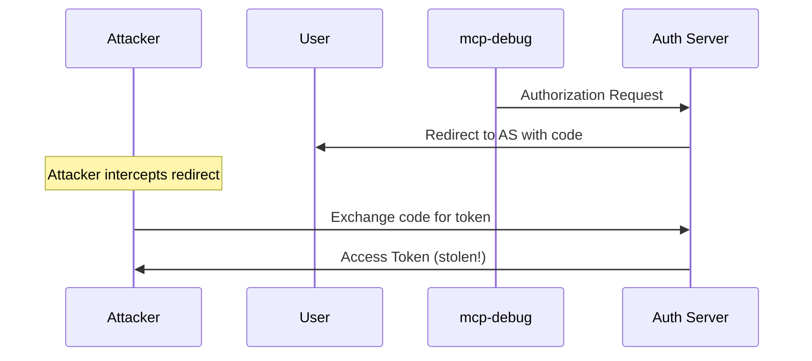
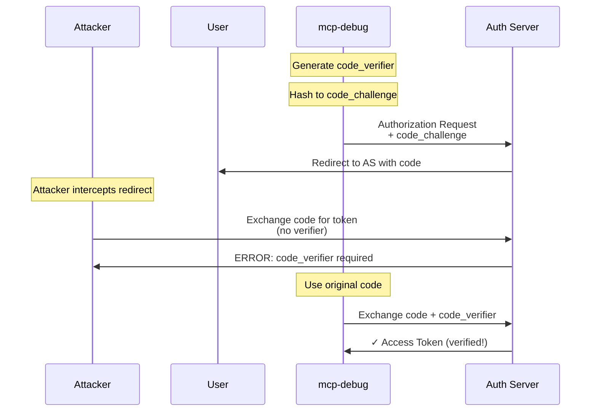

# OAuth Security

`mcp-debug` implements OAuth 2.1 with security-first defaults following industry best practices and the MCP specification requirements.

## Table of Contents

- [Security by Default](#security-by-default)
- [PKCE (Proof Key for Code Exchange)](#pkce-proof-key-for-code-exchange)
- [Resource Indicators](#resource-indicators)
- [Token Security](#token-security)
- [Scope Security](#scope-security)
- [Network Security](#network-security)
- [Credential Management](#credential-management)
- [Threat Model](#threat-model)
- [Security Best Practices](#security-best-practices)
- [Compliance](#compliance)

## Security by Default

`mcp-debug` enables security features by default - you don't need to configure them:

| Feature | Default | Security Benefit |
|---------|---------|------------------|
| PKCE | Enabled | Prevents authorization code interception |
| Resource Indicators | Enabled | Binds tokens to specific resources |
| Scope Minimization | Enabled (auto mode) | Requests minimal permissions |
| PKCE Validation | Enabled | Refuses insecure authorization servers |
| HTTPS Enforcement | Partial | Registration tokens only over HTTPS |
| In-Memory Tokens | Enabled | Tokens never persisted to disk |
| Step-Up Authorization | Enabled | Runtime permission escalation |

### Secure Defaults Example

```bash
# All security features enabled
./mcp-debug --oauth --endpoint https://mcp.example.com/mcp
```

Automatically includes:
- PKCE with S256 method
- Resource parameter (`resource=https://mcp.example.com/mcp`)
- Minimal scope selection (auto mode)
- PKCE support validation
- Step-up authorization

## PKCE (Proof Key for Code Exchange)

PKCE ([RFC 7636](https://www.rfc-editor.org/rfc/rfc7636.html)) prevents authorization code interception attacks.

### Attack Without PKCE



### Protection With PKCE



### How PKCE Works in mcp-debug

1. **Generate Code Verifier**: Random 43-128 character string
   ```
   code_verifier = dBjftJeZ4CVP-mB92K27uhbUJU1p1r_wW1gFWFOEjXk
   ```

2. **Create Code Challenge**: SHA256 hash, base64url encoded
   ```
   code_challenge = SHA256(code_verifier)
   code_challenge = E9Melhoa2OwvFrEMTJguCHaoeK1t8URWbuGJSstw-cM
   ```

3. **Authorization Request**: Include challenge
   ```
   GET /authorize?...&code_challenge=E9Melhoa...&code_challenge_method=S256
   ```

4. **Token Exchange**: Include verifier
   ```
   POST /token
   code=xyz&code_verifier=dBjftJeZ4CVP-mB92K27uhbUJU1p1r_wW1gFWFOEjXk
   ```

5. **Server Validation**: Verify hash matches
   ```
   if SHA256(code_verifier) == code_challenge:
       return access_token
   else:
       return error
   ```

### PKCE Validation

Per MCP spec, authorization servers **MUST** support PKCE with S256 method. `mcp-debug` enforces this:

```bash
./mcp-debug --oauth --endpoint https://mcp.example.com/mcp
```

Checks authorization server metadata:

```json
{
  "code_challenge_methods_supported": ["S256"]
}
```

If PKCE support is missing:

```
ERROR: Authorization server does not advertise PKCE support with S256 method
ERROR: Per MCP specification, PKCE is required for security
ERROR: Refusing to proceed with insecure authorization server
```

### PKCE is Mandatory

Per MCP Authorization Specification (2025-11-25), **PKCE is required and cannot be bypassed**.

If a server doesn't support PKCE:

```
ERROR: Authorization server does not advertise PKCE support
ERROR: This is required by MCP spec
```

**Actions:**
- Report to server operator that PKCE is mandatory
- Server must implement RFC 7636 with S256 method
- Do not proceed - PKCE is critical for security
- There is no bypass flag

## Resource Indicators

See [Resource Indicators documentation](resource-indicators.md) for complete details.

### Security Benefits

- **Token Audience Binding**: Tokens only work with intended resource
- **Theft Mitigation**: Stolen token useless for other resources
- **Least Privilege**: Resource-specific token scopes
- **Access Control**: Authorization server enforces resource policies

### Implementation

```bash
./mcp-debug --oauth --endpoint https://mcp.example.com/mcp
```

Automatically includes `resource=https://mcp.example.com/mcp` in all OAuth requests.

## Token Security

### In-Memory Only

Tokens are **never** persisted to disk:

- **Memory-Only Storage**: Tokens exist only in process memory
- **No Disk Writes**: Never saved to files, databases, or logs
- **Process Lifetime**: Tokens discarded when process exits
- **Re-authentication**: User re-authorizes on each run

**Benefits:**
- No token theft from disk
- No credential leakage via backups
- No residual tokens after process termination
- Simpler security model (no encryption keys, file permissions, etc.)

**Trade-off:**
- User must re-authorize each time (acceptable for debugging tool)

### Token Refresh

Tokens are automatically refreshed when expired:

```
[INFO] Access token expired
[INFO] Refreshing access token using refresh token...
[INFO] ✓ Access token refreshed successfully
```

Refresh tokens are also memory-only and include the resource parameter per RFC 8707.

### Token Logging

Tokens are **NEVER** logged, even in verbose mode:

```go
// Tokens redacted from logs
logger.Info("Authorization header: Bearer ***REDACTED***")
logger.Info("Refresh token: ***REDACTED***")
```

### Token Transmission

- **HTTPS Preferred**: Tokens transmitted over HTTPS when possible
- **Header-Based**: Tokens in `Authorization: Bearer` header (not URL)
- **No Query Parameters**: Tokens never in URL query strings (avoid logs)

## Scope Security

### Principle of Least Privilege

Auto mode requests minimal scopes:

```bash
# Secure: Requests only what server requires
./mcp-debug --oauth --endpoint https://mcp.example.com/mcp
```

```
[INFO] Selected scopes: [mcp:read]  (server requested only read)
```

Manual mode risks over-privileged tokens:

```bash
# Risky: Requests excessive permissions
./mcp-debug --oauth \
  --oauth-scope-mode manual \
  --oauth-scopes "mcp:admin,system:root,user:delete" \
  --endpoint https://mcp.example.com/mcp
```

### Scope Validation

`mcp-debug` validates requested scopes:

- **Excessive Scopes**: Warns if > 20 scopes (DoS/scope creep)
- **Long Scopes**: Rejects scopes > 256 characters (injection attempts)
- **Control Characters**: Rejects scopes with invalid characters
- **Wildcard Scopes**: Logs warning for scopes containing `*`

```
ERROR: Excessive number of scopes requested (25 > 20)
ERROR: scope at index 3 contains invalid control character
```

### Step-Up Authorization Security

- **Audit Logging**: All scope escalation attempts logged
- **Retry Limits**: Prevents infinite authorization loops
- **User Consent**: Browser consent for all additional permissions
- **Scope Validation**: Additional scopes validated before requesting

## Network Security

### HTTPS Enforcement

**Registration Tokens** (HTTPS only):

```bash
# Allowed: HTTPS endpoint
./mcp-debug --oauth \
  --oauth-registration-token "token" \
  --endpoint https://mcp.example.com/mcp  ✓

# Rejected: HTTP endpoint with registration token
./mcp-debug --oauth \
  --oauth-registration-token "token" \
  --endpoint http://mcp.example.com/mcp  ✗
```

Error:

```
ERROR: security: registration token can only be sent over HTTPS
```

**Redirect URIs** (localhost HTTP allowed):

Per OAuth 2.1, native applications can use `http://localhost` for callbacks:

```bash
# Allowed: localhost redirect
./mcp-debug --oauth \
  --oauth-redirect-url "http://localhost:8765/callback" \
  --endpoint https://mcp.example.com/mcp  ✓

# Rejected: non-localhost HTTP redirect
./mcp-debug --oauth \
  --oauth-redirect-url "http://example.com/callback" \
  --endpoint https://mcp.example.com/mcp  ✗
```

Error:

```
ERROR: HTTP redirect URIs are only allowed for localhost/127.0.0.1/[::1]
```

### Endpoint Validation

Registration tokens only injected into recognized OAuth endpoints:

- `/oauth/register`
- `/oauth2/registration`
- `/register`

Prevents token leakage to unintended endpoints.

### State Parameter

OAuth `state` parameter prevents CSRF attacks:

```
Authorization Request: state=abc123xyz
Callback: ?code=...&state=abc123xyz

Validate: state matches → proceed
          state differs → reject (CSRF attack)
```

`mcp-debug` automatically generates and validates state parameters.

## Credential Management

### Best Practices

**Environment Variables** (Recommended):

```bash
export OAUTH_CLIENT_SECRET="your-secret"
export OAUTH_REGISTRATION_TOKEN="your-token"

./mcp-debug --oauth \
  --oauth-client-id "your-id" \
  --oauth-client-secret "$OAUTH_CLIENT_SECRET" \
  --endpoint https://mcp.example.com/mcp
```

**Avoid Command-Line Arguments**:

```bash
# BAD: Secret visible in process list (ps, htop)
./mcp-debug --oauth \
  --oauth-client-secret "my-secret-abc123" \
  --endpoint https://mcp.example.com/mcp
```

### Credential Rotation

- Rotate client secrets regularly (quarterly recommended)
- Rotate registration tokens after each use (if single-use)
- Revoke old credentials after rotation
- Update all systems using old credentials

### Credential Storage

- **Never** commit credentials to version control
- Use `.gitignore` for credential files
- Use secret management systems (Vault, AWS Secrets Manager, etc.)
- Encrypt credentials at rest
- Limit access to credentials (file permissions, IAM policies)

## Threat Model

### In Scope

`mcp-debug` protects against:

- ✅ Authorization code interception (PKCE)
- ✅ Token misuse across resources (resource indicators)
- ✅ Over-privileged tokens (scope minimization)
- ✅ CSRF attacks (state parameter)
- ✅ Credential exposure (environment variables, no logging)
- ✅ Token theft from disk (in-memory only)
- ✅ Insecure authorization servers (PKCE validation)

### Out of Scope

`mcp-debug` does NOT protect against:

- ❌ Compromised authorization server
- ❌ Malicious MCP server
- ❌ Compromised user account
- ❌ Malware on user's machine
- ❌ Network traffic analysis (use VPN/TLS 1.3)
- ❌ Social engineering attacks

### Assumptions

Security model assumes:

- User's machine is not compromised
- Authorization server is trustworthy
- MCP server is trustworthy
- HTTPS/TLS correctly configured
- User reviews authorization prompts
- No malicious browser extensions

## Security Best Practices

### For Users

1. **Use Pre-Registered Clients**: More control than DCR
2. **Review Authorization Prompts**: Check requested scopes carefully
3. **Protect Credentials**: Use environment variables, not CLI flags
4. **Monitor Access**: Review authorization server logs regularly
5. **Keep Updated**: Update `mcp-debug` for security patches
6. **Use HTTPS**: Always use HTTPS endpoints (except localhost callback)
7. **Limit Scopes**: Request minimal scopes needed
8. **Verify Server Compliance**: Ensure servers support PKCE

### For MCP Server Operators

1. **Support PKCE**: Required by MCP specification
2. **Implement Resource Indicators**: Bind tokens to resources
3. **Advertise Capabilities**: Provide complete AS metadata
4. **Validate Tokens**: Check audience, expiration, scopes
5. **Use Refresh Tokens**: Reduce re-authentication burden
6. **Rotate Secrets**: Regularly rotate client secrets
7. **Monitor Access**: Log authorization and token usage
8. **Implement Step-Up**: Support insufficient_scope responses

### For Authorization Server Operators

1. **Support PKCE**: S256 method required
2. **Support Resource Indicators**: RFC 8707
3. **Advertise Metadata**: RFC 8414 / OIDC Discovery
4. **Validate Registration**: Rate-limit DCR endpoint
5. **Protect Against SSRF**: Validate CIMD URLs
6. **Issue Refresh Tokens**: Reduce user friction
7. **Enforce HTTPS**: For all endpoints except localhost
8. **Audit Logs**: Log all authorization events

## Compliance

### OAuth 2.1

`mcp-debug` implements [OAuth 2.1](https://datatracker.ietf.org/doc/html/draft-ietf-oauth-v2-1-11) requirements:

- ✅ PKCE required for all clients
- ✅ Exact redirect URI matching
- ✅ No implicit flow (uses authorization code flow)
- ✅ Refresh token rotation support
- ✅ State parameter required

### MCP Authorization Specification (2025-11-25)

- ✅ PKCE with S256 method
- ✅ Protected Resource Metadata discovery (RFC 9728)
- ✅ Authorization Server Metadata discovery (RFC 8414)
- ✅ Resource Indicators (RFC 8707)
- ✅ Client ID Metadata Documents (detection implemented)
- ✅ Step-up authorization with insufficient_scope
- ✅ Scope selection priority order

### RFC Compliance

- **RFC 6749**: OAuth 2.0 Authorization Framework
- **RFC 7591**: Dynamic Client Registration
- **RFC 7636**: PKCE
- **RFC 8414**: Authorization Server Metadata
- **RFC 8707**: Resource Indicators
- **RFC 9728**: Protected Resource Metadata

## See Also

- [Discovery](discovery.md): Secure discovery mechanisms
- [Resource Indicators](resource-indicators.md): Token audience binding
- [Scopes](scopes.md): Scope management and validation
- [Client Registration](client-registration.md): Secure registration methods
- [Testing](testing.md): Testing with security features disabled
- [Troubleshooting](troubleshooting.md): Security-related errors
- [MCP Authorization Spec](https://spec.modelcontextprotocol.io/specification/2025-11-25/basic/authorization/): Official requirements

